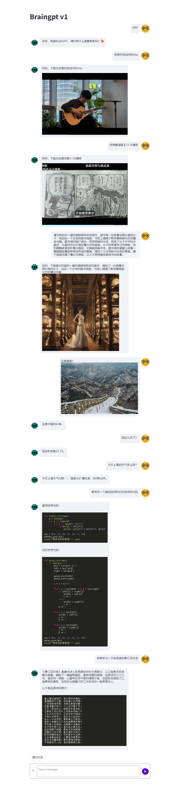

# BrainGPT1

<p align="center">
🤗 <a href="https://huggingface.co/ALmonster/braingpt-1.0" target="_blank">HF Repo</a> • 🐦 <a href="https://blog.csdn.net/a1920993165/article/details/128007435" target="_blank">blog</a>
</p>


**华东师范大学，计算机科学与技术学院，智能教育研究院**，[小怪兽会微笑](mailto:wtliu@stu.ecnu.edu.cn)

## 介绍

**BrainGPT1**是一个工具调用多轮对话模型，与GPT-4o不同的是，模型通过调用多个工具模型实现了多模态的多轮对话。因此，模型具备有工具灵活更新，定制化使用的特点。模型主要具有以下能力：

1. **通用问答**：默认使用讯飞星火大模型提供的免费API（[spark lite](https://console.xfyun.cn/services/bm35)），也可以自行接入其他API或本地模型，项目中提供了接入本地ChatGLM3的API的demo。

2. **画图能力**：默认使用[stable-diffusion-xl-base-1.0](https://huggingface.co/stabilityai/stable-diffusion-xl-base-1.0)模型。

3. **图片问答**：默认使用[InternLM-XComposer](https://github.com/InternLM/InternLM-XComposer)模型。

4. **多媒体播放**：默认代码查询并返回[bilibili](https://www.bilibili.com/)的搜索结果。

5. **天气查询**：默认使用代码查询并返回API的结果。


**BrainGPT1**的基座模型采用了[ChatGLM3](https://github.com/THUDM/ChatGLM3),经过全量微调获得，调用工具的实现方式与ChatGLM3类似。

项目前端使用streamlit框架，主要基于[Streamlit Multimodal Chat Input](https://github.com/het-25/st-multimodal-chatinput/tree/main)和[streamlit-chat](https://github.com/AI-Yash/st-chat) 实现前端的多轮多模态对话效果。


尽管模型在训练的各个阶段都尽力确保数据的合规性和准确性，但由于缺乏实际用户下的训练数据，且模型受概率随机性因素影响，无法保证输出内容的准确。本项目不承担开源模型和代码导致的数据安全、舆情风险或发生任何模型被误导、滥用、传播、不当利用而产生的风险和责任。本项目遵循[BSD 3-Clause License](https://github.com/NExT-GPT/NExT-GPT/blob/main/LICENSE.txt)。


## Demo

<p align="center">
    
</p>


## 使用方式

### 1.环境准备

```bash
conda env create -n braingpt python=3.8.8

conda activate braingpt 

pip install -r requirements.txt
```

### 2.模型准备

```bash
cd Models
git clone https://huggingface.co/ALmonster/braingpt-1.0
git clone https://huggingface.co/stabilityai/stable-diffusion-xl-base-1.0
git clone https://huggingface.co/internlm/internlm-xcomposer2-4khd-7b
```

### 3.启动模型

```bash
#默认启动在5999端口,启动Datas的文件访问服务器，用于前端显示图片
cd Datas
python simple_server.py

#默认启动在6000端口,启动braingpt
cd ../Functions/braingpt
bash brain_api.sh

#如果打算使用spark的免费api可以在web.py中配置，然后跳过这个6001步骤
#否则修改/Utils/brain_main.py的78-83行代码，把注释的解注释，把没注释的注释
#默认启动在6001端口
cd ../general_gpt
bash chatglm3_api.sh

#默认启动在6002端口,启动生成图片功能
cd ../generate_images
bash pic_api.sh

#默认启动在6003端口,启动基于图片对话功能
cd ../chat_images
bash intern_api.sh
```


### 4.启动web

```bash
#启动前端
streamlit run web.py
```


## 注意事项

1. braingpt占显存13.3G左右，stable-diffusion-xl-base-1.0占显存13.5G左右，InternLM-XComposer占显存48G左右。
2. 如果没有启动stable-diffusion-xl-base-1.0，InternLM-XComposer，但启动了braingpt，除了画图和基于图片问答功能外不受影响
3. 如果没有足够的显存启动internlm-xcomposer2-4khd-7b，可以考虑修改推理参数，或者换其他更小的模型。


## Contact

有任何问题或反馈，欢迎联系作者[小怪兽会微笑](mailto:wtliu@stu.ecnu.edu.cn)


## Star History

[](https://star-history.com/#1920993165/BrainGPT1&Date)


## Readme_EN

Previously, an incident occurred where my application for the llama3 model on Hugging Face was not approved. As a result, this document does not have an English introduction, and future applications for the model file will not be open to regions outside of mainland China.


